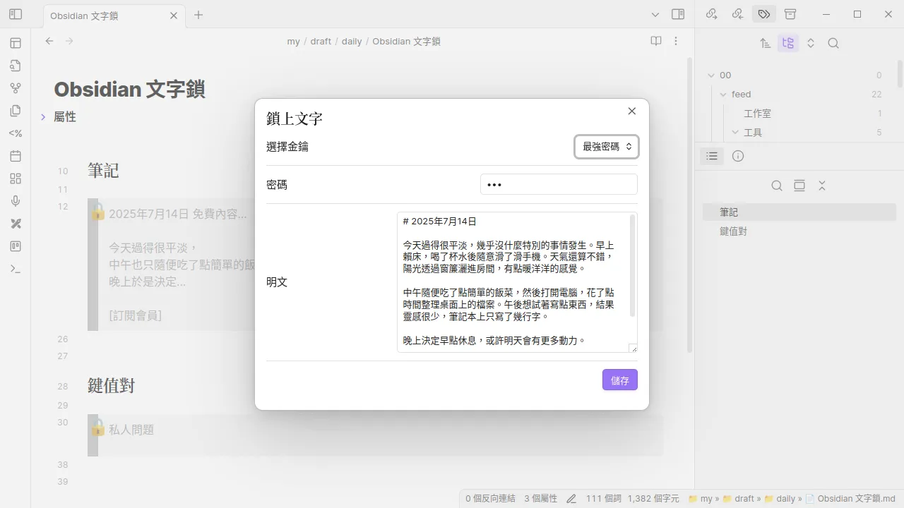
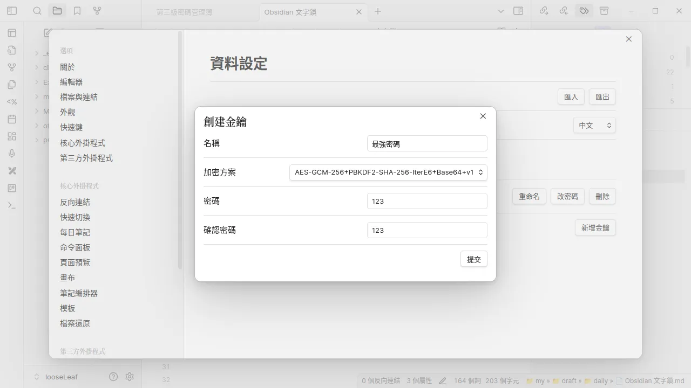

文字鎖
=======

加密 Obsidian 內容塊。


## 功能

<div>
  
  
  
  
  
</div>
<div>
  
  
</div>


## 開發

**`./src/data.ts` :**

  ```ts
  export const isTest = true;
  ```

**打包 :**

  ```bash
  deno task build
  ```


### 如何增加加密算法

請依據 [需要實現的類型](src/cryptoCan/cryptoCan.d.ts)
或參考現有的 [AES-GCM-256](src/cryptoCan/aes-gcm-256-v1.ts)
文件。
